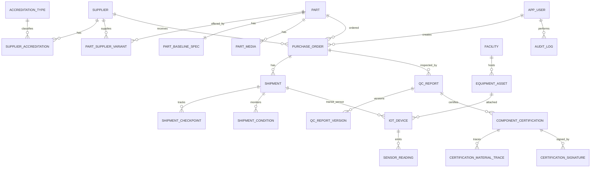

# AeroNetB Aerospace Supply Chain Management
## Database Design Document + D-II Blueprint

Student Name: ____________________  
Student ID: ____________________  
Date: 03 March 2026

---

## 1. Introduction
AeroNetB Aerospace requires an integrated data platform to replace fragmented legacy data stores and spreadsheets. The platform must support structured, semi-structured, and unstructured data, real-time IoT streams, and secure role-based access.

Design approach:
1. Build a technology-agnostic conceptual model from scenario domains.
2. Derive two logical models:
   - Relational model for high-integrity transactional domains.
   - Document model for variable/flexible report and telemetry payloads.
3. Define API and dashboard mappings to ensure implementation traceability.
4. Embed security controls (RBAC, immutability, audit logs, version history).

---

## 2. Conceptual Design (Technology-Agnostic ER)

### 2.1 Core Entities and Attributes

1. **Supplier**
   - supplierId, businessName, address, country, contactEmail, contactPhone, accreditationStatus

2. **Accreditation**
   - accreditationCode, accreditationName, issuingAuthority

3. **Part**
   - partId, partName, description, category, baselineStandardRef, criticality

4. **PartBaselineSpec**
   - mechanicalProperties, processDetails, toleranceSpec, geometryReference, engineeringNotes

5. **PartMedia**
   - mediaId, mediaType (CAD/Image/PDF/Drawing), fileReference, description

6. **PartSupplierVariant**
   - customizationSummary, processVariantDetails, handlingRequirements, notes, price, leadTime

7. **PurchaseOrder**
   - orderId, orderDate, desiredDeliveryDate, actualDeliveryDate, quantity, amount, currency, status

8. **Shipment**
   - shipmentId, trackingNo, carrier, portOfEntry, shippedAt, estimatedArrival, actualArrival, status

9. **ShipmentCheckpoint**
   - checkpointTime, location, latitude, longitude, note

10. **ShipmentCondition**
   - observedAt, temperature, vibration, pressure, shockDetected, conditionNote

11. **QCReport**
   - reportId, reportType, status, createdAt, approvedAt

12. **QCReportVersion**
   - versionNo, result, findings, failureCause, signatureRef, recordedAt

13. **ComponentCertification**
   - certificationId, status, payload, issuedAt, approvedFinalizedAt, immutableFlag

14. **MaterialTraceability**
   - batchNo, originCountry, millCertificateRef, traceNotes

15. **CertificationSignature**
   - signer, signatureHash, stampRef, signedAt

16. **Facility**
   - facilityId, name, country, city

17. **EquipmentAsset**
   - equipmentId, type, status, maintenanceDates

18. **IoTDevice**
   - deviceId, sensorType, thresholdMin, thresholdMax, activeStatus

19. **SensorReading**
   - observedAt, readingValue, gpsPosition, rawPayload

20. **User (Employee)**
   - empId, fullName, role, department, contact, accessLevel, authId, activeStatus

21. **RoleProfile (by role type)**
   - procurement limits/portfolio, inspector certifications/signature, manager KPI preferences, engineer machine groups, auditor authority/scope

22. **AuditLog**
   - eventTime, empId, action, entity, entityKey, outcome, beforeState, afterState, source metadata

### 2.2 Conceptual Relationships (Cardinalities)
- Supplier M:N Part (resolved by PartSupplierVariant).
- Supplier 1:M PurchaseOrder.
- Part 1:M PurchaseOrder.
- PurchaseOrder 1:M Shipment.
- Shipment 1:M ShipmentCheckpoint.
- Shipment 1:M ShipmentCondition.
- PurchaseOrder/Part/Supplier 1:M QCReport.
- QCReport 1:M QCReportVersion.
- QCReport 1:M ComponentCertification.
- ComponentCertification 1:M MaterialTraceability.
- ComponentCertification 1:M CertificationSignature.
- Facility 1:M EquipmentAsset.
- EquipmentAsset 1:M IoTDevice.
- Shipment 1:M IoTDevice (for transit sensors).
- IoTDevice 1:M SensorReading.
- User 1:M actions in AuditLog, and 1:M authored/approved business records.

### 2.3 Conceptual ER Diagram (Mermaid)


---

## 3. Logical Design

## 3.1 Relational Logical Model (SQL Server)
Relational model is implemented in `gio.sql` and covers:
- Master entities: users/roles, suppliers, parts, accreditations.
- Transaction entities: purchase orders, shipments, checkpoints/conditions.
- Quality entities: QC reports + version table.
- Certification entities: immutable approved certifications + signatures + traceability.
- IoT entities: facilities, equipment, devices, readings, alerts.
- Security entities: audit logs and user-linked actions.

### Key relational design decisions
1. **Normalization**: M:N domains resolved through bridge tables (`part_supplier_variant`, `supplier_accreditation`).
2. **Flexible attributes in SQL**: selective JSON fields for variable structures (`findings_json`, `cert_payload_json`, `raw_payload_json`).
3. **QC versioning**: immutable historical snapshots in `qc_report_version` with `(report_id, version_no)` uniqueness.
4. **Certification immutability**: trigger prevents update/delete once approved/finalized.
5. **Auditability**: all key actor actions traceable to `emp_id`.

### Suggested schema diagram grouping
- **Access & Security**: app_user, role profiles, audit_log.
- **Supplier/Part**: supplier, accreditation, part, baseline spec, media, variants.
- **Order/Shipment**: purchase_order, shipment, checkpoints, conditions.
- **Quality/Compliance**: qc_report, qc_report_version, component_certification + traces/signatures.
- **IoT/Equipment**: facility, equipment_asset, iot_device, sensor_reading, maintenance_alert.

## 3.2 Document Logical Model (MongoDB)
Use MongoDB for high-variance, nested, or high-volume event data.

### Collection A: `qc_reports`
```json
{
  "_id": "QCR-2026-1001",
  "orderId": "PO-2026-0001",
  "partId": "PART-A320-FP-01",
  "supplierId": "SUP-001",
  "reportType": "COMBINED",
  "status": "SUBMITTED",
  "versions": [
    {
      "versionNo": 1,
      "inspectorEmpId": "E2001",
      "recordedAt": "2026-03-03T12:05:00Z",
      "result": "PASS",
      "findings": {
        "dimensional": { "status": "PASS", "deviations": [] },
        "ndt": { "status": "PASS", "method": "UT" }
      },
      "failureCause": null,
      "signatureRef": "https://.../QCR-2026-1001-v1.sig"
    }
  ],
  "audit": {
    "createdBy": "E2001",
    "createdAt": "2026-03-03T12:00:00Z"
  }
}
```

### Collection B: `component_certifications`
```json
{
  "_id": "CERT-2026-9001",
  "reportId": "QCR-2026-1001",
  "partId": "PART-A320-FP-01",
  "supplierId": "SUP-001",
  "inspectorEmpId": "E2001",
  "status": "APPROVED",
  "immutable": true,
  "approvedFinalizedAt": "2026-03-03T13:20:00Z",
  "materialTraceability": [
    {
      "batchNo": "BATCH-TI-33881",
      "originCountry": "Germany",
      "millCertificateRef": "mill://certs/ti33881.pdf"
    }
  ],
  "signatures": [
    {
      "signerEmpId": "E2001",
      "signatureHash": "sha256:...",
      "stampRef": "stamp://quality/E2001",
      "signedAt": "2026-03-03T13:15:00Z"
    }
  ],
  "payload": {
    "testResults": {},
    "regulatoryRefs": []
  }
}
```

### Collection C: `iot_events`
```json
{
  "_id": "evt-01-20260303T100000Z",
  "deviceId": "DEV-TEMP-01",
  "targetType": "EQUIPMENT",
  "targetId": "EQ-CNC-01",
  "sensorType": "TEMPERATURE",
  "observedAt": "2026-03-03T10:00:00Z",
  "value": 52.3,
  "unit": "C",
  "threshold": { "min": 5, "max": 70 },
  "isAnomaly": false,
  "rawPayload": { "temp": 52.3, "unit": "C" }
}
```

### Collection D: `shipment_tracking`
```json
{
  "_id": "SHIP-0001",
  "orderId": "PO-2026-0001",
  "trackingNo": "TRK-AX-445577",
  "carrier": "BlueSky Logistics",
  "status": "IN_TRANSIT",
  "eta": "2026-03-18T12:00:00Z",
  "checkpoints": [
    {
      "time": "2026-03-03T09:30:00Z",
      "geo": { "lat": 38.423733, "lon": 27.142826 },
      "location": "Aegean Sea Corridor",
      "note": "On schedule"
    }
  ],
  "conditions": [
    {
      "time": "2026-03-03T09:30:00Z",
      "temperature": 18.4,
      "vibration": 1.12,
      "pressure": 101.2,
      "shockDetected": false
    }
  ]
}
```

### Document model rationale
- Embeds nested report/test structures naturally.
- Handles variable sensor/event payloads without schema migrations.
- Supports fast read for dashboard drill-down documents.

---

## 4. API Design and Development Blueprint

| Method | Endpoint URI | Description | Data Stores Accessed | Role Access |
|---|---|---|---|---|
| GET | /api/suppliers | Supplier list + accreditation summary | SQL: supplier, supplier_accreditation | Procurement, Manager, Auditor |
| GET | /api/parts/{id}/suppliers | Supplier variants for a part | SQL: part_supplier_variant | Procurement, Manager |
| POST | /api/orders | Create purchase order | SQL: purchase_order | Procurement |
| PATCH | /api/orders/{id}/status | Update order state transition | SQL: purchase_order | Procurement, Manager |
| GET | /api/shipments/live | Current shipments with latest checkpoint/ETA | SQL + Mongo shipment_tracking | Manager, Procurement |
| GET | /api/shipments/{id} | Drill-down shipment details | SQL + Mongo shipment_tracking | Manager, Procurement, Auditor |
| POST | /api/qc/reports | Create QC report version | SQL qc_report/qc_report_version + Mongo qc_reports | Inspector |
| POST | /api/qc/reports/{id}/approve | Approve QC report and snapshot | SQL + Mongo | Inspector |
| GET | /api/qc/analytics | QC pass/fail trends and failure causes | SQL + Mongo aggregation | Inspector, Manager, Auditor |
| POST | /api/certifications | Create draft certification | SQL + Mongo component_certifications | Inspector |
| POST | /api/certifications/{id}/finalize | Finalize and lock certification (immutable) | SQL trigger + Mongo immutable flag | Inspector (approve) |
| GET | /api/certifications/{id} | Certification with traceability and signatures | SQL + Mongo | Inspector, Auditor, Manager |
| GET | /api/iot/equipment/{id}/timeseries | Sensor trend data for equipment | SQL sensor_reading / Mongo iot_events | Engineer, Manager |
| GET | /api/iot/alerts | Active anomalies and maintenance alerts | SQL maintenance_alert + Mongo iot_events | Engineer, Manager |
| GET | /api/audit/logs | Compliance access trail | SQL audit_log | Auditor |

---

## 5. Dashboard Implementation Mapping

### I. Shipment Tracking & Order Visibility
- Data: shipment, checkpoints, conditions, order planned vs ETA.
- Widgets: map panel, delayed shipments table, shipment drill-down card.

### II. Supplier Performance Analytics
- KPIs: on-time delivery %, QC defect rate, trend scorecards.
- Widgets: supplier leaderboard, comparative defect chart by part.

### III. QC Insights
- KPIs: pass/fail trend, top failure causes, inspector throughput, cert approvals.
- Widgets: pie chart by part type, 12-month failure line chart, inspector report table.

### IV. Equipment & IoT Monitoring
- KPIs: machine health status, threshold breaches, predictive maintenance triggers.
- Widgets: live time-series graph, facility status board (OK/WARNING/CRITICAL).

### V. Role-Specific Views
- Procurement: order creation/pending deliveries/supplier contact.
- Quality Inspector: pending inspections/report forms/certification actions.
- Supply Chain Manager: global shipment + KPI overview.
- Equipment Engineer: IoT dashboard + maintenance alerts.
- Auditor/Regulator: read-only compliance and immutable records.

### VI. General Features
- Search/filter by supplier, part, order, report, date range.
- Export to CSV/PDF.
- Drill-down from chart to record list.
- Alert banner for overdue orders, failed QC, equipment anomalies.

---

## 6. Security, Compliance, and Transition Controls

1. **Authentication**: employee-authenticated access (authId mapped to empId).
2. **Authorization**: role and access-level checks per endpoint.
3. **Immutability**:
   - SQL trigger prevents update/delete of approved certifications.
   - Mongo certification documents set `immutable: true` at finalize stage.
4. **Versioning**:
   - QC report history preserved in version records, never overwritten.
5. **Auditability**:
   - Every view/edit/approve/export action captured with empId and timestamp.
6. **Transition**:
   - Legacy data ingest into staging tables/collections.
   - Reconciliation checks for supplier, part, order identities.
   - Progressive cutover by module (suppliers → orders → QC → IoT).

---

## 7. Deliverable Packaging Checklist

## D-I (`{studentID}_DDD.pdf` preferred)
- Title page with name + ID.
- Introduction.
- Conceptual ER model (diagram + description).
- Relational logical model diagram.
- Document logical model schema/structures.
- Conclusion of design decisions.

## D-II (`{studentID}_DII.zip`)
- Logbook (`{studentID}_Logbook.pdf`) with implementation details, refined models, API table, dashboard screenshots, deployment rationale.
- SQL script file(s): DDL + DML (use `gio.sql`).
- Source code (backend + frontend only, no dependency folders).
- Optional: video demo (`{studentID}_videoDemo.{format}`).

## D-III Demo Prep
- Live run path ready (cloud preferred, local acceptable if same build).
- 15–20 minute walkthrough: DB + APIs + dashboard + RBAC + immutability/audit proof.

---

## 8. Conclusion
The proposed hybrid data architecture assigns transactional integrity and compliance-critical records to SQL Server, while using MongoDB for nested/variable payloads and event-heavy streams. This satisfies AeroNetB’s requirement for integrated multi-domain visibility, role-based security, QC/certification governance, and real-time monitoring at operational and strategic levels.
